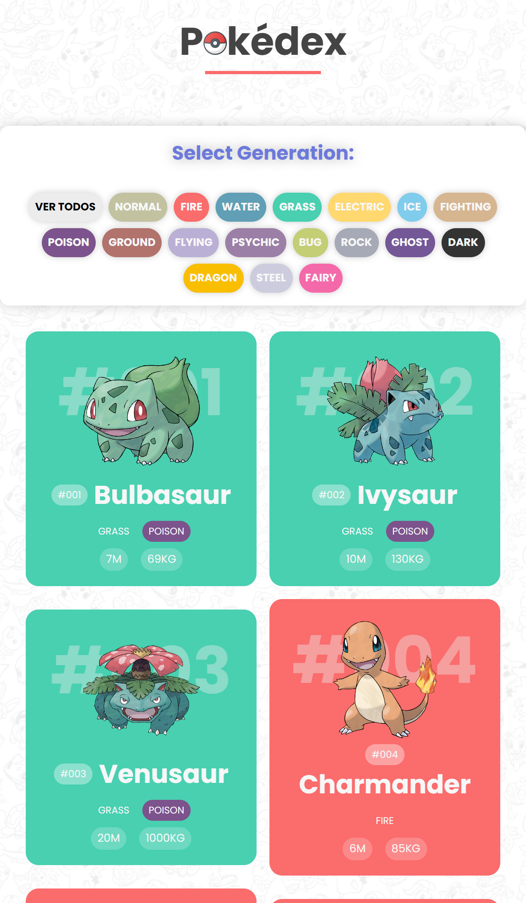

# Pokédex con PokéAPI
- Sitio web responsive de portafolio personal que utiliza HTML, CSS y JavaScript y la API de pokemen
- Desplazamiento suave en cada sección.
- Incluye un modo claro y oscuro.
- Desarrollado primero con la metodología Mobile First, luego para escritorio.
- Compatible con todos los dispositivos móviles y con una bonita y agradable interfaz de usuario.

